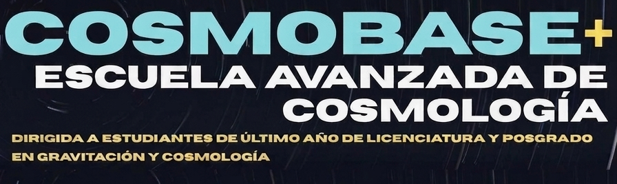

<p align="center">
  
</p>

# CLASS_Free_ulSFDM-workshop
This repository contains the notebooks and installation instructions used during the CLASS-ulSFDM workshop.  The CLASS source code is hosted in a separate repository:  https://github.com/JRomanHerrera/class_public_ulSFDM
# Taller: Cosmología con CLASS-ulSFDM

Bienvenido al repositorio del taller **Cosmología con CLASS-ulSFDM**.

Este repositorio contiene los **notebooks de Jupyter**, el ambiente de Python y las instrucciones necesarias para instalar y utilizar la versión modificada del código **CLASS-ulSFDM**, la cual implementa un modelo de **Materia Oscura Escalar Ultraligera Libre (free ultralight Scalar Field Dark Matter, ulSFDM)**.

El código fuente de CLASS-ulSFDM se encuentra en un repositorio independiente:

> https://github.com/JRomanHerrera/class_publicSFDM

---

# Requisitos

Antes de comenzar necesitarás:

- Una conexión a Internet.
- Git.
- Miniconda.
- Un compilador de C/C++.
- Jupyter Notebook o JupyterLab (se instalará automáticamente con el ambiente).

El procedimiento funciona en:

- macOS
- Linux
- Windows (mediante WSL2)

---

# 1. Instalar Miniconda

Si aún no tienes instalado Miniconda, descárgalo desde

https://www.anaconda.com/download

Sigue las instrucciones correspondientes a tu sistema operativo.

Una vez instalado, verifica que Conda funciona correctamente:

```bash
conda --version
```

---

# 2. Crear el ambiente de Python

Desde la carpeta de este repositorio ejecuta

```bash
conda env create -f environment.yml
```

Una vez finalizada la instalación activa el ambiente

```bash
conda activate ulsfdm
```

Verifica que Python corresponde al ambiente recién creado

```bash
python --version
```

---

# 3. Descargar CLASS-ulSFDM

Clona el repositorio del código fuente

```bash
git clone https://github.com/JRomanHerrera/class_publicSFDM.git
```

Entra al directorio

```bash
cd class_publicSFDM
```

---

# 4. Compilar CLASS

## macOS

```bash
make clean
make CC=clang CXX=clang++
```

## Linux

```bash
make clean
make CC=gcc CXX=g++
```

## Windows (WSL2)

Dentro de Ubuntu ejecute exactamente el mismo procedimiento que en Linux

```bash
make clean
make CC=gcc CXX=g++
```

Al finalizar deberá generarse correctamente la biblioteca de CLASS y el módulo de Python `classy`.

---

# 5. Verificar la instalación

Ejecute el archivo de ejemplo

```bash
./class sfdm.ini
```

Si la instalación fue correcta, CLASS calculará la evolución cosmológica sin mostrar errores.

También puede comprobar que Python encuentra correctamente el módulo `classy`

```bash
python -c "from classy import Class; print('CLASS instalado correctamente.')"
```

---

# 6. Iniciar Jupyter

Regrese a la carpeta del taller y ejecute

```bash
jupyter lab
```

o bien

```bash
jupyter notebook
```

Se abrirá automáticamente el navegador.

---

# 7. Abrir los notebooks

Dentro de Jupyter abra la carpeta

```
notebooks/
```

Los notebooks están organizados para seguir el mismo orden del taller.

Se recomienda ejecutarlos secuencialmente.

---

# Contenido del taller

Los notebooks muestran cómo utilizar CLASS-ulSFDM para calcular diferentes observables cosmológicos, entre ellos

- Evolución del fondo cosmológico.
- Evolución de perturbaciones lineales.
- Espectro de potencia de materia.
- Anisotropías de temperatura del Fondo Cósmico de Microondas (CMB).
- Comparación entre ΛCDM y materia oscura escalar ultraligera.

---

# Referencias

La implementación de **free ulSFDM** utilizada en este taller está basada en una versión modificada del código **CLASS (Cosmic Linear Anisotropy Solving System)**.

Si utiliza este código en trabajos de investigación, por favor cite tanto CLASS como la publicación asociada a esta implementación.

Repositorio de CLASS

https://github.com/lesgourg/class_public

Repositorio de CLASS-ulSFDM

https://github.com/JRomanHerrera/class_publicSFDM

Repositorio del taller

https://github.com/JRomanHerrera/class_public_ulSFDM-workshop
