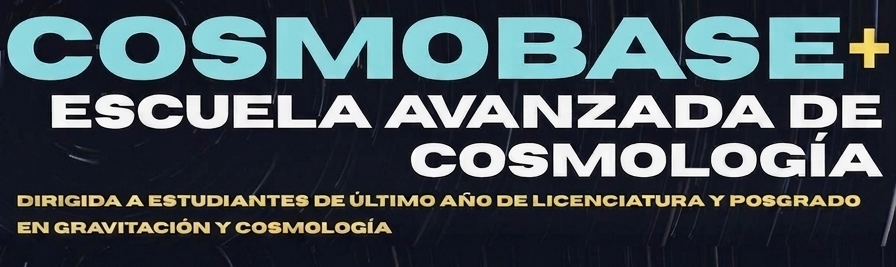

<p align="center">
  
</p>

# CLASS_Free_ulSFDM-workshop
This repository contains the notebooks and installation instructions used during the CLASS-ulSFDM workshop.  The CLASS source code is hosted in a separate repository:  https://github.com/JRomanHerrera/class_public_ulSFDM
# Taller: Cosmología con CLASS-ulSFDM

Bienvenido al repositorio del taller **Cosmología con CLASS-ulSFDM**.

Este repositorio contiene los **notebooks de Jupyter**, el ambiente de Python y las instrucciones necesarias para instalar y utilizar la versión modificada del código **CLASS-ulSFDM**, la cual implementa un modelo de **Materia Oscura Escalar Ultraligera Libre (free ultralight Scalar Field Dark Matter, ulSFDM)**.

El código fuente de CLASS-ulSFDM se encuentra en un repositorio independiente:

> https://github.com/JRomanHerrera/class_publicSFDM

---

# Requisitos

Antes de comenzar, asegúrate de tener instalado lo siguiente:

- Conexión a Internet.
- Git.
- Miniconda (o Anaconda).
- GNU Make.
- Un compilador de C/C++ (por ejemplo, GCC o Clang).

El entorno de Conda instalará automáticamente:

- Jupyter Notebook.
- JupyterLab.
- Todas las dependencias de Python necesarias para el taller.

Este procedimiento ha sido probado en:

- macOS.
- Linux.
- Windows (mediante WSL2).

---

# 1. Instalar Miniconda

Si aún no tienes instalado Miniconda, descárgalo desde

https://www.anaconda.com/download

Sigue las instrucciones correspondientes a tu sistema operativo.

Una vez instalado, verifica que Conda funciona correctamente:

```bash
conda --version
```
---

# 2. Crear un directorio de trabajo

Crea un directorio donde descargarás el repositorio del taller y el código fuente de CLASS-ulSFDM, ejemplo:

```bash
mkdir cosmobase
cd cosmobase
```

Clona el repositorio del taller:

```bash
git clone https://github.com/JRomanHerrera/CLASS_Free_ulSFDM-workshop.git
```

---

# 3. Crear el ambiente de Python

Entra al directorio del taller:

```bash
cd CLASS_Free_ulSFDM-workshop
```

Crea el ambiente de Conda:

```bash
conda env create -f environment.yml
```

Una vez finalizada la instalación activa el ambiente:

```bash
conda activate class-ulsfdm
```

Verifica que Python corresponde al ambiente recién creado:

```bash
python --version
```

La salida debe ser similar a:

```text
Python 3.11.x
```

También puedes comprobar que se está utilizando el Python del ambiente de Conda:

```bash
which python
```

La salida debe ser similar a:

```text
.../miniconda3/envs/class-ulsfdm/bin/python
```

Si ambas comprobaciones son correctas, regresa al directorio de trabajo:

```bash
cd ..
```

---

# 4. Descargar CLASS-ulSFDM

Clona el repositorio del código fuente:

```bash
git clone https://github.com/JRomanHerrera/class_publicSFDM.git
```

Entra al directorio:

```bash
cd class_publicSFDM
```

---
# 5. Verificar el compilador y el Makefile

Antes de compilar **CLASS-ulSFDM**, verifica que el compilador de C/C++ configurado en el `Makefile` sea compatible con tu sistema operativo.

Estas instrucciones fueron verificadas en:

- **macOS** (M2).
- **Windows 11** utilizando **WSL2 (Ubuntu)**.

En otras distribuciones de Linux o configuraciones diferentes, las opciones del compilador pueden variar ligeramente.

---

## macOS

Comprueba que `clang` y `clang++` estén disponibles:

```bash
clang --version
clang++ --version
```

Abre el archivo `Makefile` y verifica que las siguientes líneas sean:

```make
CC       = clang
CPP      = clang++ --std=c++11 -fpermissive -Wno-write-strings

OPTFLAG = -O3

OMPFLAG = -pthread
```


---

## Linux / Windows (WSL2)

Comprueba que `gcc` y `g++` están instalados:

```bash
gcc --version
g++ --version
```

Abre el archivo `Makefile` y verifica que las siguientes líneas sean:

```make
CC       = gcc
CPP      = g++ --std=c++11 -fpermissive -Wno-write-strings

OPTFLAG = -O3 -fcommon

OMPFLAG = -fopenmp
```

---

> **Nota**
>
> Si alguno de los comandos `clang --version`, `clang++ --version`, `gcc --version` o `g++ --version` devuelve un mensaje como `command not found`, primero deberás instalar las herramientas de desarrollo correspondientes antes de continuar.

---

## Verificación

Si los comandos anteriores muestran correctamente la versión del compilador y el `Makefile` quedó configurado como se indicó, puedes continuar con la compilación de **CLASS-ulSFDM**.

---
# 6. Compilar CLASS-ulSFDM

Una vez configurado el `Makefile`, compila CLASS-ulSFDM ejecutando:

```bash
make clean
make
```

La compilación puede tardar algunos minutos, dependiendo de las características de tu equipo.

Si la compilación finaliza correctamente, se generarán:

- El ejecutable `class`.
- La biblioteca `libclass.a`.
- El módulo de Python `classy`, el cual se instalará automáticamente en el ambiente de Conda activo.

Al finalizar la compilación deberías observar un mensaje similar al siguiente:

```text
Successfully built classy
Installing collected packages: classy
Successfully installed classy-3.3.4.0
```
---

# 7. Verificar la instalación

Como verificación adicional, comprueba que el módulo `classy` puede importarse correctamente desde Python:

```bash
python -c "from classy import Class; print('CLASS instalado correctamente.')"
```

Si todo se instaló correctamente, la salida será:

```text
CLASS instalado correctamente.
```

También puedes comprobar desde qué ubicación se está importando el módulo:

```bash
python -c "import classy; print(classy.__file__)"
```

La salida debe ser similar a:

```text
.../miniconda3/envs/class-ulsfdm/lib/python3.11/site-packages/classy/__init__.py
```

Si ambas comprobaciones son correctas, la instalación de `classy` ha finalizado exitosamente.

Como verificación final, ejecuta el archivo de ejemplo incluido en el repositorio:

```bash
./class sfdm.ini
```

Si la instalación fue correcta, CLASS-ulSFDM calculará la evolución cosmológica sin mostrar errores. Al inicio de la ejecución deberías observar un mensaje similar al siguiente:

```text
Reading input parameters
Computing unknown input parameter 'sfdm_shooting_parameter' using input parameter 'omega_sfdm'
 -> matched budget equations by adjusting Omega_Lambda = 0.688637
...
Running CLASS version v3.3.4
Computing background
...
Computing thermodynamics using RecFastCLASS (based on v1.5)
...
Computing linear Fourier spectra.
...
Writing output files in output/sfdm00_...
```

No es necesario que la salida coincida exactamente línea por línea. Lo importante es que:

- No aparezcan mensajes de error (`Error`, `Segmentation fault`, `Abort`, etc.).
- La ejecución finalice correctamente.
- Se generen los archivos de salida en el directorio:

```text
output/
```

Si todas las comprobaciones anteriores son satisfactorias, la instalación de CLASS-ulSFDM ha finalizado correctamente y puedes continuar con los notebooks del taller.

---

# 8. Iniciar Jupyter

Regrese a la carpeta del taller y ejecute:

```bash
jupyter lab
```

o bien:

```bash
jupyter notebook
```

Se abrirá automáticamente el navegador.

---

# 9. Abrir los notebooks

Dentro de Jupyter abra la carpeta:

```
notebooks/
```

Los notebooks están organizados para seguir el mismo orden del taller.

Se recomienda ejecutarlos secuencialmente.

---

# Contenido del taller

Los notebooks están organizados para introducir progresivamente el uso de **CLASS-ulSFDM**, desde la instalación y las primeras simulaciones hasta el cálculo de observables cosmológicos.

El contenido incluye:

## Introducción

- Introducción a CLASS y `classy`.
- Primera simulación con ΛCDM.
- Primeras gráficas cosmológicas.

## Modelo ulSFDM

- Estructura del archivo `sfdm.ini`.
- Evolución del fondo cosmológico.
- Condiciones iniciales.
- Evolución de perturbaciones lineales.

## Observables cosmológicos

- Espectro de potencia de materia.
- Anisotropías del CMB.
- Comparación entre ΛCDM y ulSFDM.

---

# Referencias

La implementación de **free ulSFDM** utilizada en este taller está basada en una versión modificada del código **CLASS (Cosmic Linear Anisotropy Solving System)**.

Si utiliza este código en trabajos de investigación, por favor cite tanto CLASS como la publicación asociada a esta implementación.

Repositorio de CLASS

https://github.com/lesgourg/class_public

Repositorio de CLASS-ulSFDM

https://github.com/JRomanHerrera/class_publicSFDM

Repositorio del taller

https://github.com/JRomanHerrera/class_public_ulSFDM-workshop
